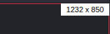

# Show Screen Size (sss)

**Version 1.0**

Show Screen Size is a self-contained Javascript which displays screen dimensions in a tiny layer for debugging CSS and layout issues. The layer appears in the upper right corner and can be enabled/disabled by multiple methods.




## How it works

Show Screen Size (sss.js) injects a small display element `<div>` into your page before the closing `<body>` tag and then writes the screen dimensions to it. It appears in the upper right hand corner of the page as a small white layer (18 px high x 70 px wide) with black numbers on it. (See screenshot above). The left number is the width and the right number is the height. The units are in pixels. The script uses `window.innerWidth` and `window.innerHeight` for the screen dimensions. 

These dimensions are the interior width and height of the current browser window (the layout viewport). This includes the width and height of any scroll bars (if they are present). 

<i>Note: If you need to obtain the width/height of the window minus scroll bars and borders, you'll have to request the root `<html>` or `<body>` element's clientWidth / clientHeight properties instead. This script doesn't do that.</i> 

# Usage

### 1. Download the script (`sss.js`) to your project. (Or, if you prefer, you can use a CDN link:)

   - https://cdn.jsdelivr.net/npm/@kendawson-online/showscreensize@1.0.0/sss.min.js
   - https://cdn.jsdelivr.net/gh/kendawson-online/sss@v1.0/sss.js

### 2. Include it in your HTML document right before the closing `<body>` tag:

Local script example:
```html
    <script src="sss.js"></script>

</body>
</html>
```
<br>

CDN links (pick one):

```html
<script src="https://cdn.jsdelivr.net/npm/@kendawson-online/showscreensize@1.0.0/sss.min.js"></script>
```

```html
<script src="https://cdn.jsdelivr.net/gh/kendawson-online/sss@v1.0/sss.js"></script>
```


### 3. Clear cache/cookies and reload your page. If the script is loaded, you should see this message in the developer console:

   - `Show Screen Size (sss.js) loaded. Press 1 or 0 to toggle, use URL params ss=1/ss=0, or call window.sssToggle().`

<br>

## The display layer will be hidden by default when page loads!

This is the default behavior of the script. **Nothing will appear in the GUI until you make it appear**. 

<br>

# Toggling the display:


#### <u>Keyboard control</u>: 

<kbd>1</kbd> (one) key shows the display

<kbd>0</kbd> (zero) key hides the display

#### <u>URL parameter control</u>:

passing parameter: `?ss=1` (or `?ss=true`) in URL turns on display

passing parameter: `?ss=0` (or `?ss=false`) in URL turns off display

#### <u>Programmatic control</u>:

type `window.sssToggle()` in developer console to toggle the display

<br>

# Notes

 * The primary reason I created this script was to see screen dimensions on mobile devices while troubleshooting CSS / layout issues. That's why the URL parameters exist — to toggle dimension display without having access to dev console.

 * I know that when developer console is open the browser automatically shows the screen dimensions. That feature works great on deskop/laptop computers while developing and troubleshooting. But, on phones, and tablets, and other devices you can't enable developer console. This provides an easy way to see screen sizes on all devices.

 * The script is entirely self-contained. It creates it's own `<div>` element and inserts it before the closing `<body>` tag with inline CSS styling. You only have to include this script in your document and it will automatically start running when the document loads. 

 * The script saves data to local storage to keep track of the on/off state of the layer. If you reload the page it will restore the previous state you set it to. Example: if you turn it on and reload the page it will appear "on" again. If you clear cache/cookies or local storage data it will lose track of the state and return to default settings ("off"). Just press the <kbd>1</kbd> key to turn the layer back on again. 

 * The URL parameters intentionally trigger an alert to let you know when the display is turned on or off. This was done for confirmation since developers are not able to easily access developer console on mobile devices. If you don't want to see these alerts you can change this value: `const urlAlerts = true`. Set the value to false instead.

 * Each time the script is loaded, it displays a message with usage instructions in dev console. If you want to disable these messages you can change this value: `const consoleMsg = true`. Set the value to false instead.

<br>

# License

[MIT](LICENSE)
